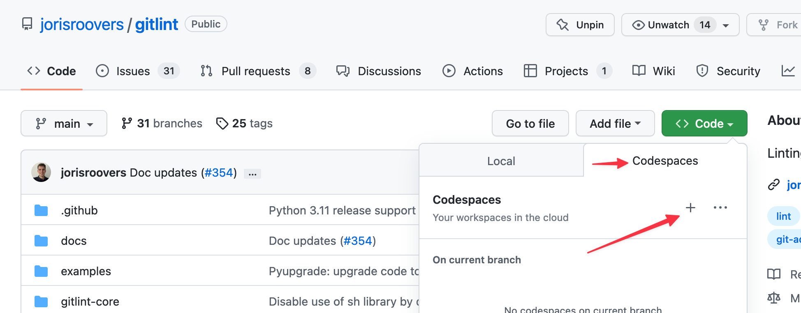

# Contributing

We'd love for you to contribute to gitlint. Thanks for your interest!
The [source-code and issue tracker](https://github.com/jorisroovers/gitlint) are hosted on Github.

!!! note
    Often it takes a while for us (well, actually just [me](https://github.com/jorisroovers)) to get back to you
    (sometimes up to a few months, this is a hobby project), but rest assured that we read your message and appreciate
    your interest!
    We maintain a [loose project plan on github projects](https://github.com/users/jorisroovers/projects/1/), but
    that's open to a lot of change and input.

## Overall Guidelines

When contributing code, please consider all the parts that are typically required:

- [Unit tests](https://github.com/jorisroovers/gitlint/tree/main/gitlint-core/gitlint/tests) (automatically
  [enforced by CI](https://github.com/jorisroovers/gitlint/actions)). Please consider writing
  new ones for your functionality, not only updating existing ones to make the build pass.
- [Integration tests](https://github.com/jorisroovers/gitlint/tree/main/qa) (also automatically
  [enforced by CI](https://github.com/jorisroovers/gitlint/actions)). Again, please consider writing new ones
  for your functionality, not only updating existing ones to make the build pass.
- [Documentation](https://github.com/jorisroovers/gitlint/tree/main/docs).

Since we want to maintain a high standard of quality, all of these things will have to be done regardless before code
can make it as part of a release. **Gitlint commits and pull requests are gated on all of our tests and checks as well as
code-review**. If you can already include them as part of your PR, it's a huge timesaver for us
and it's likely that your PR will be merged and released a lot sooner. 

!!! important
    It's a good idea to open an issue before submitting a PR for non-trivial changes, so we can discuss what you have
    in mind before you spend the effort. Thanks!

## Releases
Gitlint releases typically go out when there's either enough new features and fixes
to make it worthwhile or when there's a critical fix for a bug that fundamentally breaks gitlint.

While the amount of overhead of doing a release isn't huge, it's also not zero. In practice this means that it might
take weeks or months before merged code actually gets released - we know that can be frustrating but please
understand it's a well-considered trade-off based on available time.

### Dev Builds
While final releases are usually months apart, we do dev builds on every commit to `main`:

- **gitlint**: [https://pypi.org/project/gitlint/#history](https://pypi.org/project/gitlint/#history)
- **gitlint-core**:  [https://pypi.org/project/gitlint-core/#history](https://pypi.org/project/gitlint-core/#history)

It usually takes about 5 min after merging a PR to `main` for new dev builds to show up. Note that the installation
of a recently published version can still fail for a few minutes after a new version shows up on PyPI while the package
is replicated to all download mirrors.

To install a dev build of gitlint:
```sh
# Find latest dev build on https://pypi.org/project/gitlint/#history
pip install gitlint=="0.19.0.dev68"
```


## Environment setup
### Local setup

Gitlint uses [hatch](https://hatch.pypa.io/latest/) for project management.
You do not need to setup a `virtualenv`, hatch will take care of that for you.

```sh
pip install hatch
```

### Github Codespace

We provide a devcontainer to use with github codespaces to make it easier to get started with gitlint development
using VSCode.

To start one, click the plus button under the *Code* dropdown on
[the gitlint repo on github](https://github.com/jorisroovers/gitlint). 

**It can take ~15min for all post installation steps to finish.**




By default we have python 3.11 installed in the dev container, but you can also use [asdf](https://asdf-vm.com/)
(preinstalled) to install additional python versions:

```sh
# Ensure ASDF overrides system python in PATH
# You can also append this line to your ~/.bash_profile in the devcontainer to have this happen automatically on login
source "$(brew --prefix asdf)/libexec/asdf.sh"

# Install python 3.9.15
asdf install python 3.9.15
# Make python 3.9.15 the default python
asdf global python 3.9.15

# IMPORTANT: install hatch for this python version
pip install hatch==1.6.3
# You also need to prune your hatch environment first before running other commands
hatch env prune

# List all available python versions
asdf list all python
# List installed python versions
asdf list python
```


## Running tests
```sh
# Gitlint
hatch run dev:gitlint            # run the local source copy of gitlint
hatch run dev:gitlint --version  # This is just the gitlint binary, any flag will work
hatch run dev:gitlint --debug       

# Unit tests
hatch run test:unit-tests        # run unit tests
hatch run test:unit-tests gitlint-core/gitlint/tests/rules/test_body_rules.py::BodyRuleTests::test_body_missing # run a single test
hatch run test:unit-tests -k test_body_missing_merge_commit # Run a specific tests using a pytest keyword expression
hatch run test:unit-tests-no-cov # run unit tests without test coverage

# Integration tests
hatch run qa:install-local       # One-time install: install the local gitlint source copy for integration testing
hatch run qa:integration-tests   # Run integration tests

# Formatting check (black)
hatch run test:format            # Run formatting checks

#  Linting (ruff)
hatch run test:lint              # Run Ruff

# Project stats
hatch run test:stats
```
## Autoformatting and autofixing

We use [black](https://black.readthedocs.io/en/stable/) for code formatting.

```sh
hatch run test:autoformat                              # format all python code
hatch run test:autoformat gitlint-core/gitlint/lint.py # format a specific file
```

We use [ruff](https://github.com/charliermarsh/ruff) for linting, it can autofix many of the issue it finds
(although not always perfect).
```sh
hatch run test:autofix                              # Attempt to fix linting issues
```

## Documentation
We use [mkdocs](https://www.mkdocs.org/) for generating our documentation from markdown.

To use it:
```sh
hatch run docs:serve
```

Then access the documentation website on [http://localhost:8000]().

## Packaging

Gitlint consists of 2 python packages: [gitlint](https://pypi.org/project/gitlint/)
and [gitlint-core](https://pypi.org/project/gitlint-core/).

The `gitlint` package is just a wrapper package around `gitlint-core[trusted-deps]` which strictly pins gitlint
dependencies to known working versions.

There are scenarios where users (or OS package managers) may want looser dependency requirements.
In these cases, users can just install `gitlint-core` directly (`pip install gitlint-core`).

[Issue 162](https://github.com/jorisroovers/gitlint/issues/162) has all the background of how we got to the decision
to split gitlint in 2 packages.


To build the packages locally:
```sh
# gitlint
hatch build
hatch clean # cleanup

# gitlint-core
cd gitlint-core
hatch build
hatch clean # cleanup
```

## Tools
We keep a small set of scripts in the `tools/` directory:

```sh
tools/create-test-repo.sh            # Create a test git repo in your /tmp directory
tools/windows/create-test-repo.bat   # Windows: create git test repo
tools/windows/run_tests.bat          # Windows run unit tests
```

## Contrib rules
Since gitlint 0.12.0, we support [Contrib rules](contrib_rules.md): community contributed rules that are part of gitlint
itself. Thanks for considering to add a new one to gitlint!

Before starting, please read all the other documentation on this page about contributing first.
Then, we suggest taking the following approach to add a Contrib rule:

1. **Write your rule as a [user-defined rule](user_defined_rules.md)**. In terms of code, Contrib rules are identical to
   user-defined rules, they just happen to have their code sit within the gitlint codebase itself.
2. **Add your user-defined rule to gitlint**. You should put your file(s) in the [gitlint/contrib/rules](https://github.com/jorisroovers/gitlint/tree/main/gitlint-core/gitlint/contrib/rules) directory.
3. **Write unit tests**. The gitlint codebase contains [Contrib rule test files you can copy and modify](https://github.com/jorisroovers/gitlint/tree/main/gitlint-core/gitlint/tests/contrib/rules).
4. **Write documentation**. In particular, you should update the [gitlint/docs/contrib_rules.md](https://github.com/jorisroovers/gitlint/blob/main/docs/contrib_rules.md) file with details on your Contrib rule.
5. **Create a Pull Request**: code review typically requires a bit of back and forth. Thanks for your contribution!


### Contrib rule requirements
If you follow the steps above and follow the existing gitlint conventions wrt naming things, you should already be fairly close to done.

In case you're looking for a slightly more formal spec, here's what gitlint requires of Contrib rules.

- Since Contrib rules are really just user-defined rules that live within the gitlint code-base, all the [user-rule requirements](user_defined_rules.md#rule-requirements) also apply to Contrib rules.
- All contrib rules **must** have associated unit tests. We *sort of* enforce this by a unit test that verifies that there's a
  test file for each contrib file.
- All contrib rules **must** have names that start with `contrib-`. This is to easily distinguish them from default gitlint rules.
- All contrib rule ids **must** start with `CT` (for LineRules targeting the title), `CB` (for LineRules targeting the body) or `CC` (for CommitRules). Again, this is to easily distinguish them from default gitlint rules.
- All contrib rules **must** have unique names and ids.
- You **can** add multiple rule classes to the same file, but classes **should** be logically grouped together in a single file that implements related rules.
- Contrib rules **should** be meaningfully different from one another. If a behavior change or tweak can be added to an existing rule by adding options, that should be considered first. However, large [god classes](https://en.wikipedia.org/wiki/God_object) that implement multiple rules in a single class should obviously also be avoided.
- Contrib rules **should** use [options](user_defined_rules.md#options) to make rules configurable.
