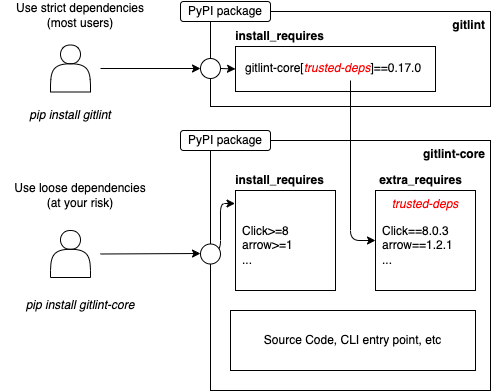

# Packaging

Gitlint consists of 2 python packages: [gitlint](https://pypi.org/project/gitlint/)
and [gitlint-core](https://pypi.org/project/gitlint-core/).

The `gitlint` package is just a wrapper package around `gitlint-core[trusted-deps]` which strictly pins gitlint
dependencies to known working versions.

There are scenarios where users (or OS package managers) may want looser dependency requirements.
In these cases, users can just install `gitlint-core` directly (`pip install gitlint-core`).

[Issue 162](https://github.com/jorisroovers/gitlint/issues/162) has all the background of how we got to the decision
to split gitlint in 2 packages.



To build the packages locally:
```sh
# gitlint
hatch build
hatch clean # cleanup

# gitlint-core
cd gitlint-core
hatch build
hatch clean # cleanup
```